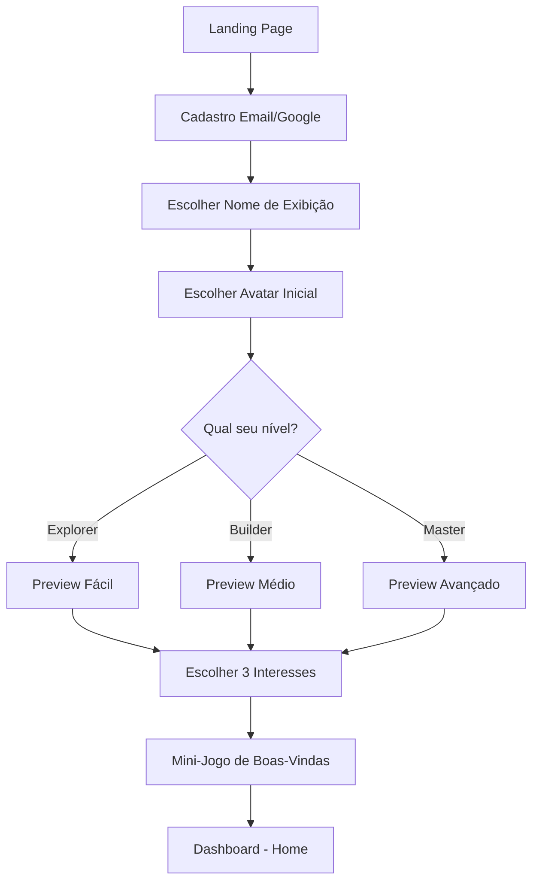
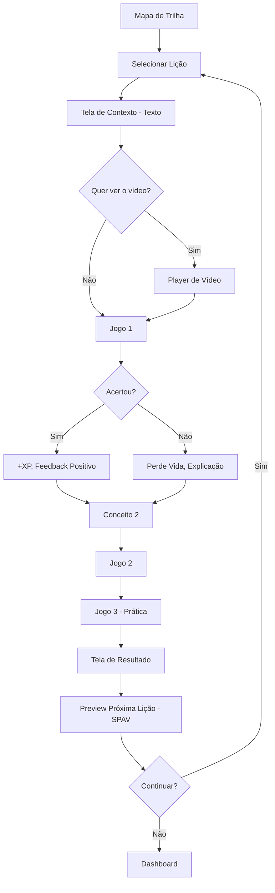
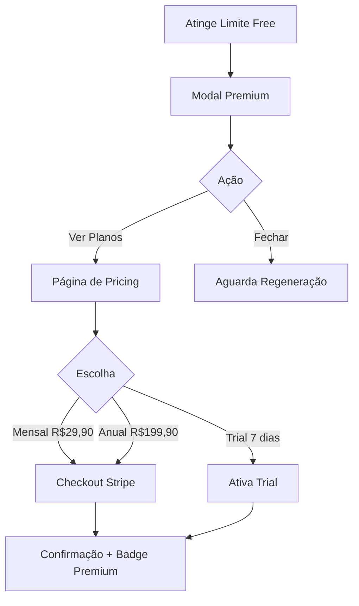

# 🏰 DOMINIA — Product Requirements Document (PRD)

> **Plataforma Gamificada de Aprendizado em Inteligência Artificial**
> Versão 1.0 | Fevereiro 2026 | Documento Confidencial

---

## 📋 Índice

1. [Visão Geral & Problema](#1-visão-geral--problema)
2. [Público-Alvo & Perfis](#2-público-alvo--perfis)
3. [Análise Competitiva](#3-análise-competitiva)
4. [Arquitetura de Features](#4-arquitetura-de-features)
5. [Sistema de Gamificação](#5-sistema-de-gamificação)
6. [Arquitetura de Conteúdo](#6-arquitetura-de-conteúdo)
7. [Arquitetura Técnica](#7-arquitetura-técnica)
8. [User Flows Principais](#8-user-flows-principais)
9. [Estratégia de Monetização](#9-estratégia-de-monetização)
10. [KPIs & Métricas de Sucesso](#10-kpis--métricas-de-sucesso)
11. [Roadmap Detalhado](#11-roadmap-detalhado)
12. [User Stories & Acceptance Criteria](#12-user-stories--acceptance-criteria)
13. [Riscos & Mitigações](#13-riscos--mitigações)
14. [Apêndices](#14-apêndices)

---

## 1. Visão Geral & Problema

### 1.1 Declaração de Visão

**Dominia** é uma plataforma web gamificada de aprendizado em Inteligência Artificial que transforma cada lição em um jogo viciante. O princípio central: **aprender deve ser tão envolvente quanto se divertir**.

A plataforma personaliza a experiência de cada usuário com base em seu **nível de conhecimento autopercebido** (Fácil / Médio / Avançado), entregando o **mesmo conteúdo** com abordagens de ensino radicalmente diferentes.

### 1.2 O Problema

O aprendizado sobre IA em 2026 é:

| Problema | Impacto | Quem sofre |
|----------|---------|------------|
| **Fragmentado** | Cursos espalhados sem conexão entre si | Todos |
| **Passivo** | Vídeos longos com 90%+ de abandono | Iniciantes e intermediários |
| **Descontextualizado** | Teoria sem aplicação prática imediata | Profissionais |
| **One-size-fits-all** | Mesma linguagem para todos os níveis | Iniciantes e avançados |
| **Sem engajamento** | Sem gamificação real, sem recompensa | Jovens 14-22 |
| **Desatualizado** | Ferramentas de IA mudam semanalmente | Todos |

### 1.3 A Solução

A Dominia resolve isso colocando **o perfil do usuário no centro**, combinando:

```
GAMIFICAÇÃO PROFUNDA + CONTEÚDO ADAPTATIVO + APLICAÇÃO PRÁTICA IMEDIATA
```

**Exemplo prático:** Três pessoas querem aprender sobre geração de imagens com IA.

| Aspecto | Nível Fácil | Nível Médio | Nível Avançado |
|---------|-------------|-------------|----------------|
| **Linguagem** | Simples, visual, passo a passo | Equilibrada, com termos técnicos explicados | Técnica, direta, com referências |
| **Formato** | Micro-jogos visuais + tutorial guiado | Desafios práticos + quiz interativo | Projetos reais + integração com APIs |
| **Ritmo** | 3-5 min/lição, sem pressão | 5-7 min/lição, ritmo moderado | 7-10 min/lição, trilha intensiva |
| **Resultado** | Cria uma imagem e compartilha | Cria um conjunto de imagens com prompt engineering | Implementa pipeline de geração automatizada |
| **Gamificação** | Conquistas simples, celebrações grandes | Rankings e desafios semanais | Certificações e portfolio |

### 1.4 Proposta de Valor Única (UVP)

> **"A única plataforma que une gamificação profunda com IA adaptativa, transformando cada lição em um jogo — onde você aprende e JÁ USA o que aprendeu, no seu ritmo e no seu nível."**

---

## 2. Público-Alvo & Perfis

### 2.1 Público Primário do MVP

**Jovens de 14 a 22 anos** que querem aprender IA de forma prática e divertida.

**Características comportamentais:**
- Nativos digitais, acostumados com TikTok, Instagram, games
- Atenção fragmentada (3-7 minutos de foco)
- Motivados por competição, status social e conquistas visíveis
- Preferem aprender fazendo, não assistindo
- Valorizam estética moderna e experiências mobile-friendly

### 2.2 Sistema de Níveis (Substituindo Perfis Etários)

> ⚠️ **DECISÃO CRÍTICA:** O sistema NÃO é baseado em idade. O próprio usuário escolhe como quer aprender.

| Nível | Nome no Sistema | Descrição | Abordagem de Ensino |
|-------|----------------|-----------|---------------------|
| 🟢 | **Explorer** (Fácil) | "Sou novo nisso, quero entender do zero" | Visual, simplificado, muitas analogias, passo a passo guiado |
| 🟡 | **Builder** (Médio) | "Já sei o básico, quero aplicar" | Prático, com contexto técnico acessível, desafios moderados |
| 🔴 | **Master** (Avançado) | "Quero dominar e implementar" | Técnico, direto, projetos complexos, APIs e automação |

**Regras do Sistema de Níveis:**
1. O usuário escolhe seu nível no onboarding
2. Pode trocar de nível a qualquer momento
3. O **conteúdo base é idêntico** — muda apenas a linguagem, profundidade e tipo de exercício
4. O sistema pode **sugerir** mudança de nível baseado em performance (mas nunca forçar)
5. A estrutura é extensível para novos perfis futuros

### 2.3 Personas do MVP

#### Persona 1: Lucas, 17 anos — "O Curioso Digital"
- **Contexto:** Estudante do ensino médio, usa muito Instagram e TikTok
- **Objetivo:** Aprender a criar conteúdo com IA para redes sociais
- **Nível escolhido:** Explorer → Builder
- **Motivação:** Quer impressionar amigos e ganhar seguidores
- **Barreira:** Acha tecnologia "difícil" ou "só pra programadores"

#### Persona 2: Mariana, 21 anos — "A Universitária Prática"
- **Contexto:** Universitária de Marketing, quer se destacar no mercado
- **Objetivo:** Usar IA para automatizar trabalhos e criar conteúdo profissional
- **Nível escolhido:** Builder → Master
- **Motivação:** Diferencial competitivo no mercado de trabalho
- **Barreira:** Tempo limitado entre faculdade e estágio

#### Persona 3: Pedro, 15 anos — "O Gamer que Quer Criar"
- **Contexto:** Jogador ávido, quer criar seus próprios projetos
- **Objetivo:** Usar IA para criar imagens, músicas e jogos
- **Nível escolhido:** Explorer
- **Motivação:** A gamificação — quer "zerar" todas as trilhas
- **Barreira:** Não tem cartão de crédito (depende dos pais para premium)

---

## 3. Análise Competitiva

### 3.1 Mapa Competitivo Detalhado

| Funcionalidade | Duolingo | Coursera | Khan Academy | Brilliant | AWS/Google | **DOMINIA** |
|----------------|----------|----------|--------------|-----------|------------|-------------|
| Gamificação profunda | ✅ Referência | ❌ | ⚠️ Básica | ⚠️ Parcial | ⚠️ Parcial | ✅ **Core** |
| Adaptação por nível autopercebido | ❌ | ❌ | ⚠️ | ❌ | ❌ | ✅ **Único** |
| Mesmo conteúdo, ensino diferente | ❌ | ❌ | ❌ | ❌ | ❌ | ✅ **Único** |
| IA generativa no ensino | ⚠️ | ❌ | ⚠️ Khanmigo | ❌ | ⚠️ | ✅ **Core** |
| Lições como jogos interativos | ✅ | ❌ | ❌ | ⚠️ | ❌ | ✅ **Core** |
| Foco em IA prática do dia a dia | ❌ | ⚠️ | ❌ | ❌ | ⚠️ Próprias | ✅ **Único** |
| Micro-aprendizado (3-7 min) | ✅ | ❌ | ⚠️ | ⚠️ | ❌ | ✅ |
| Trilhas conectadas em árvore | ❌ Linear | ❌ | ❌ | ⚠️ | ❌ | ✅ **Único** |
| Aplicação prática imediata | ❌ | ⚠️ | ❌ | ⚠️ | ⚠️ | ✅ **Core** |
| Comunidade + social learning | ⚠️ Ligas | ⚠️ Fóruns | ❌ | ❌ | ❌ | ✅ Phase 2 |
| Certificações | ❌ | ✅ | ❌ | ❌ | ✅ | ✅ Phase 3 |
| Preço acessível | ✅ Freemium | ❌ Caro | ✅ Free | ❌ Premium | ✅ Free | ✅ Freemium |

### 3.2 Vantagem Competitiva Sustentável (Moat)

```
                    DOMINIA MOAT
                    ┌─────────────┐
                    │  CONTEÚDO   │ ← Mesmo conteúdo, 3 abordagens
                    │  ADAPTATIVO │   (ninguém faz isso para IA)
                    ├─────────────┤
                    │ GAMIFICAÇÃO │ ← Lições são JOGOS, não vídeos
                    │  COMO CORE  │   (Duolingo-level mas para IA)
                    ├─────────────┤
                    │  APLICAÇÃO  │ ← Cada lição gera resultado
                    │  IMEDIATA   │   real e visível
                    ├─────────────┤
                    │   TRILHAS   │ ← Árvore de habilidades estilo RPG
                    │ CONECTADAS  │   (progressão infinita)
                    └─────────────┘
```

---

## 4. Arquitetura de Features

### 4.1 Features do MVP (Must Have — P0)

#### F01: Sistema de Onboarding & Perfil
- **Descrição:** Fluxo de cadastro gamificado com seleção de nível (Explorer/Builder/Master) e interesses
- **Componentes:**
  - Cadastro via email ou Google OAuth
  - Seleção de nível com preview visual de cada abordagem
  - Escolha de 3-5 tópicos de interesse (IA Generativa, Imagens, Vídeos, Automação, etc.)
  - Criação de avatar/personagem inicial
  - Mini-jogo de boas-vindas (primeira lição como showcase)
- **Regra:** O onboarding inteiro deve ser completável em **menos de 3 minutos**
- **Regra:** O usuário pode mudar nível e interesses a qualquer momento nas configurações

#### F02: Trilhas de Aprendizado Gamificadas (Mapa Visual)
- **Descrição:** Mapa visual estilo árvore/RPG onde cada nó é uma lição-jogo
- **Componentes:**
  - Mapa 2D scrollável com nós interconectados
  - Nós representam lições individuais (3-7 minutos cada)
  - Caminhos se desbloqueiam progressivamente
  - Bifurcações permitem escolha de especialização
  - Indicadores visuais de progresso (%, estrelas, badges)
  - Animações de desbloqueio e celebração
- **Mínimo MVP:** 10 trilhas completas e organizadas visualmente
- **Regra:** Cada trilha tem 8-15 lições-jogos

#### F03: Lições como Jogos Interativos
- **Descrição:** Cada lição é um jogo diferente que ensina um conceito
- **Tipos de Jogos:**

| Tipo de Jogo | Mecânica | Melhor Para | Exemplo |
|--------------|----------|-------------|---------|
| **Quiz Battle** | Perguntas com timer, vidas e power-ups | Conceitos teóricos | "O que é um LLM?" |
| **Drag & Drop** | Arrastar elementos para posições corretas | Fluxos e processos | "Monte o prompt ideal" |
| **Fill the Gap** | Completar texto/código com lacunas | Prompts e comandos | "Complete o prompt para gerar ___" |
| **Match Pairs** | Conectar conceitos com definições | Vocabulário técnico | "Conecte a ferramenta com seu uso" |
| **Sequence Builder** | Ordenar passos na sequência correta | Workflows | "Ordene o pipeline de automação" |
| **Speed Challenge** | Responder o máximo em tempo limitado | Revisão e fixação | "Quantos conceitos em 60s?" |
| **Sandbox** | Área livre para experimentar com IA | Aplicação prática | "Crie um prompt e veja o resultado" |
| **Boss Battle** | Desafio final combinando vários conceitos | Final de trilha | "Use tudo que aprendeu para resolver" |

- **Regra:** Cada lição alterna entre teoria rápida (texto + vídeo) e jogo prático
- **Regra:** Mínimo 3 tipos de jogos diferentes por trilha
- **Regra:** Cada jogo tem feedback imediato (certo/errado + explicação)

#### F04: Conteúdo Texto + Vídeo
- **Descrição:** Cada lição tem um componente de conteúdo teórico curto
- **Componentes:**
  - Texto adaptado ao nível do usuário (mesmo conceito, linguagem diferente)
  - Vídeo curto (1-3 min) hospedado no YouTube como não-listado
  - Player de vídeo embeddado na plataforma
  - Texto com highlights, exemplos visuais e GIFs quando aplicável
- **Regra:** Texto máximo de 300 palavras por lição (nível Fácil), 500 (Médio), 700 (Avançado)
- **Regra:** Vídeo é complementar, não obrigatório para completar a lição

#### F05: Sistema de Gamificação Base
- **Descrição:** Sistema completo de pontos, streaks, badges e níveis
- **(Detalhado na Seção 5)**

#### F06: Dashboard de Progresso do Aprendiz
- **Descrição:** Painel pessoal com visão completa do progresso
- **Componentes:**
  - Visão geral: trilhas ativas, % de conclusão, streak atual
  - Gráfico de atividade (heatmap estilo GitHub)
  - Estatísticas: lições completadas, XP total, ranking
  - Conquistas e badges desbloqueados
  - Histórico de atividade
  - Próximas lições recomendadas
  - Pontos fortes e áreas para melhorar
- **Regra:** O dashboard é a **home** do usuário logado

#### F07: Assistente de IA Contextual
- **Descrição:** Chatbot integrado que responde dúvidas no contexto da lição atual
- **Componentes:**
  - Widget de chat flutuante durante as lições
  - Respostas adaptadas ao nível do usuário (mesma dúvida, linguagem diferente)
  - Sugestões de revisão quando detecta dificuldade
  - Limite de mensagens para usuários gratuitos (10/dia)
  - Ilimitado para Premium
- **Motor:** Híbrido (regras locais para perguntas frequentes + LLM API para questões complexas)

#### F08: Sistema de Pagamento Freemium
- **Descrição:** Modelo freemium com gateway de pagamento
- **Componentes:**
  - Plano Free: acesso a 3 trilhas, 5 lições/dia, assistente IA limitado
  - Plano Premium: acesso total, sem limites, certificados
  - Gateway de pagamento (Stripe ou Mercado Pago)
  - Página de pricing com comparativo
  - Trial de 7 dias do Premium
- **Preço MVP:** R$ 29,90/mês ou R$ 199,90/ano

#### F09: Painel Administrativo (CMS)
- **Descrição:** Sistema administrativo para gestão de conteúdo
- **Componentes:**
  - CRUD de Trilhas (criar, editar, reordenar, publicar/despublicar)
  - CRUD de Lições dentro de cada trilha
  - Editor de conteúdo por nível (Fácil/Médio/Avançado)
  - Upload/link de vídeo do YouTube
  - Configurador de jogos (tipo, perguntas, respostas, dificuldade)
  - Preview de como a lição aparece para cada nível
  - Dashboard de métricas (usuários, engajamento, receita)
  - Gestão de usuários
- **Regra:** Interface intuitiva para que UMA pessoa gerencie todo o conteúdo eficientemente

#### F10: Sistema de Notificações Inteligentes (SPAV)
- **Descrição:** Sistema de Próxima Aula Viciante — notificações baseadas em comportamento
- **Componentes:**
  - Email de "Sua trilha está quase completa!" 
  - Push notification (PWA) com preview da próxima lição
  - Gancho ao final de cada lição: "Na próxima, você vai aprender a..."
  - Lembrete de streak em risco
  - Celebração de milestones via notificação
- **Regra:** Máximo 2 notificações/dia para não irritar

### 4.2 Features da Fase 2 (Should Have — P1)

| ID | Feature | Descrição |
|----|---------|-----------|
| F11 | **Universo Narrativo** | Avatar evoluível com história personalizada por nível |
| F12 | **Social Learning** | Grupos de estudo, mentoria entre usuários, study clubs |
| F13 | **Rankings & Ligas** | Competição semanal entre usuários, ligas por nível |
| F14 | **Sistema B2B** | Planos corporativos e para escolas com painel de gestão |
| F15 | **Expansão para 25+ Trilhas** | Redes Sociais, Automação, Chatbots, etc. |
| F16 | **Spaced Repetition** | Sistema de revisão espaçada cientificamente comprovado |
| F17 | **Daily Challenges** | Desafios diários temáticos com recompensas especiais |
| F18 | **Parental Controls** | Controle parental para menores de 16 (LGPD) |

### 4.3 Features da Fase 3 (Could Have — P2)

| ID | Feature | Descrição |
|----|---------|-----------|
| F19 | **Certificações** | Emissão de certificados com verificação de identidade |
| F20 | **Dominia Coins** | Moeda virtual + loja de customização |
| F21 | **Internacionalização** | Espanhol e Inglês |
| F22 | **API Pública** | Integrações de terceiros |
| F23 | **Marketplace de Criadores** | Criadores externos publicam conteúdo |
| F24 | **Parcerias Co-Branding** | Integrações com ferramentas de IA |
| F25 | **App Nativo** | React Native / Flutter com offline real |

---

## 5. Sistema de Gamificação

### 5.1 Economia de XP (Experience Points)

| Ação | XP Ganho | Multiplicador |
|------|----------|---------------|
| Completar lição | 50 XP | x1.5 se perfeito (sem erros) |
| Acertar questão no jogo | 10 XP | x2 se streak de 5+ acertos |
| Completar trilha | 500 XP | x2 se < 7 dias |
| Streak diário | 20 XP | +10 por dia consecutivo |
| Boss Battle vencido | 200 XP | x3 se primeira tentativa |
| Daily Challenge | 100 XP | Varia por dificuldade |
| Convidar amigo | 300 XP | Uma vez por amigo |

### 5.2 Sistema de Níveis do Usuário

| Nível | XP Necessário | Título | Desbloqueio |
|-------|--------------|--------|-------------|
| 1-5 | 0-500 | Aprendiz | Acesso básico |
| 6-10 | 500-2.000 | Explorador | Novos avatares |
| 11-20 | 2.000-8.000 | Construtor | Desafios especiais |
| 21-35 | 8.000-25.000 | Especialista | Rankings |
| 36-50 | 25.000-60.000 | Mestre | Badge exclusivo |
| 50+ | 60.000+ | Lenda do Dominia | Título permanente |

### 5.3 Streaks & Saúde do Aprendizado

**Streak (sequência diária):**
- Completa pelo menos 1 lição por dia = streak mantido
- Perde streak após 24h sem atividade
- **Freeze:** 1 congelamento gratuito por semana (Premium: 3)
- **Recuperação:** Pode "recuperar" streak perdido completando 3 lições (máx 48h)

**Anti-burnout:**
- Após 60 minutos contínuos: "Hora de descansar! Seu cérebro precisa processar 🧠"
- Medalha "Equilíbrio" para quem estuda consistentemente sem exageros
- Sem punição excessiva por perder streak (cultura saudável)

### 5.4 Badges & Conquistas

| Categoria | Exemplos | Raridade |
|-----------|----------|----------|
| **Progresso** | "Primeira Lição", "10 Trilhas", "1000 XP" | Comum |
| **Consistência** | "7 dias seguidos", "30 dias", "100 dias" | Rara |
| **Maestria** | "Perfeito em 5 lições", "Boss sem errar" | Épica |
| **Social** | "Convidou 5 amigos", "Top 10 semanal" | Rara |
| **Especial** | "Early Adopter", "Beta Tester", "Fundador" | Lendária |

### 5.5 Sistema de Vidas & Retry

- **5 vidas** por sessão (Free); **Ilimitadas** (Premium)
- Erro em questão = perde 1 vida
- Vidas regeneram: 1 a cada 30 minutos
- Assistir ao vídeo da lição restaura 1 vida
- **Sem vidas = não pode avançar** (incentivo para Premium ou paciência)

---

## 6. Arquitetura de Conteúdo

### 6.1 Estrutura em Árvore de Trilhas (MVP — 10 Trilhas)

```
🏰 DOMINIA
│
├── 🤖 INTELIGÊNCIA ARTIFICIAL GERAL
│   ├── Trilha 01: "O que é IA?" (Fundamentos)
│   │   └── 10 lições: História → Tipos de IA → Como funciona → LLMs → Ética
│   ├── Trilha 02: "ChatGPT & Assistentes" (IA Conversacional)
│   │   └── 12 lições: Primeiros passos → Prompts → Uso profissional → Limites
│   └── Trilha 03: "Gemini, Claude & Outros" (Multi-ferramentas)
│       └── 10 lições: Comparação → Quando usar qual → Integração
│
├── 🎨 CRIAÇÃO COM IA
│   ├── Trilha 04: "Imagens com IA" (Midjourney, DALL-E, Flux)
│   │   └── 12 lições: Básico → Prompts → Estilos → Uso comercial
│   ├── Trilha 05: "Vídeos com IA" (Sora, Runway, Kling)
│   │   └── 10 lições: Geração → Edição → Storytelling → Produção
│   └── Trilha 06: "Textos & Copy com IA"
│       └── 10 lições: Posts → E-mails → Roteiros → Persuasão
│
├── 📱 REDES SOCIAIS + IA
│   ├── Trilha 07: "Instagram + IA" (Reels, Stories, Carrosséis)
│   │   └── 10 lições: Conteúdo → Edição → Crescimento → Automação
│   └── Trilha 08: "TikTok + IA" (Trends, Roteiro, Edição)
│       └── 10 lições: Trends → Script → Edição → Viralização
│
└── ⚡ AUTOMAÇÃO & PRODUTIVIDADE
    ├── Trilha 09: "Automação com N8N/Zapier"
    │   └── 10 lições: Conceitos → Fluxos → Templates → Negócios
    └── Trilha 10: "Chatbots com IA" (WhatsApp, Sites)
        └── 10 lições: Tipos → Construção → Integração → Casos reais
```

### 6.2 Anatomia de Uma Lição

```
┌─────────────────────────────────────────┐
│           LIÇÃO: "Criando Prompts"       │
├─────────────────────────────────────────┤
│                                         │
│  📖 CONTEXTO (30s leitura)              │
│  "Prompts são instruções que você dá    │
│   para a IA. Quanto melhor o prompt,    │
│   melhor o resultado..."                │
│                                         │
│  ▶️ VÍDEO (1-3 min, opcional)           │
│  [Player YouTube embed]                 │
│                                         │
│  🎮 JOGO 1: Quiz Battle (5 questões)   │
│  "Qual destes é um bom prompt?"         │
│  → Feedback imediato + explicação       │
│                                         │
│  📖 CONCEITO AVANÇADO (30s)             │
│  "Agora que você sabe o básico,         │
│   vamos aprender sobre contexto..."     │
│                                         │
│  🎮 JOGO 2: Drag & Drop                │
│  "Monte o prompt ideal arrastando       │
│   os blocos na ordem certa"             │
│                                         │
│  🎮 JOGO 3: Sandbox                    │
│  "Agora é sua vez! Crie um prompt       │
│   e veja o resultado em tempo real"     │
│                                         │
│  🏆 RESULTADO                           │
│  "+50 XP | ⭐⭐⭐ | Badge: Prompt Jr."  │
│  "Próxima: Prompts Avançados 🔓"       │
│                                         │
└─────────────────────────────────────────┘
```

### 6.3 Adaptação por Nível (Mesmo Conceito)

**Conceito: "O que é um LLM?"**

| Aspecto | 🟢 Explorer | 🟡 Builder | 🔴 Master |
|---------|-------------|------------|-----------|
| **Texto** | "Um LLM é como um amigo super inteligente que leu milhões de livros. Você pergunta algo e ele responde com base em tudo que aprendeu!" | "LLM (Large Language Model) é um modelo de IA treinado em bilhões de textos para entender e gerar linguagem natural. Funciona por previsão de tokens." | "LLMs são redes neurais transformer com bilhões de parâmetros, treinados via self-supervised learning em corpora massivos, usando attention mechanisms para gerar sequências." |
| **Jogo** | Quiz visual com imagens e analogias | Quiz + completar diagrama do pipeline | Completar código de fine-tuning |
| **Prática** | "Faça 3 perguntas ao ChatGPT e veja as respostas" | "Compare respostas do ChatGPT, Claude e Gemini para o mesmo prompt" | "Implemente uma chamada à API do OpenAI com diferentes temperaturas" |

---

## 7. Arquitetura Técnica

### 7.1 Stack Tecnológico

| Camada | Tecnologia | Justificativa |
|--------|-----------|---------------|
| **Frontend** | Next.js 14+ (App Router) | SSR, performance, PWA support, React ecosystem |
| **Styling** | Tailwind CSS v4 | Rapid UI, dark mode, responsive |
| **State** | Zustand | Leve, simples, sem boilerplate |
| **Backend** | Supabase (BaaS) | Auth, DB, Realtime, Storage — 1 pessoa = BaaS |
| **Database** | PostgreSQL (via Supabase) | Relacional, JSONB para conteúdo adaptativo |
| **Auth** | Supabase Auth (Email + Google) | OAuth, session management integrado |
| **Pagamentos** | Stripe ou Mercado Pago | Assinaturas recorrentes, webhooks |
| **IA/LLM** | OpenAI API + regras locais | Assistente contextual + adaptação |
| **Vídeos** | YouTube Embed (unlisted) | Sem custo de hosting, CDN gratuito |
| **Analytics** | PostHog ou Mixpanel (Free tier) | Eventos, funis, retenção |
| **Deploy** | Vercel | Zero-config para Next.js, edge functions |
| **PWA** | next-pwa | Instalável, push notifications |

### 7.2 Modelo de Dados Principal

```
┌─────────────┐     ┌──────────────┐     ┌─────────────┐
│   USERS      │────▶│ USER_PROGRESS │◀────│   LESSONS    │
│              │     │              │     │              │
│ id           │     │ user_id      │     │ id           │
│ email        │     │ trail_id     │     │ trail_id     │
│ name         │     │ lesson_id    │     │ position     │
│ avatar_url   │     │ status       │     │ title        │
│ level_pref   │     │ score        │     │ content_easy │
│ xp_total     │     │ stars        │     │ content_med  │
│ streak_days  │     │ completed_at │     │ content_hard │
│ is_premium   │     │ attempts     │     │ video_url    │
│ created_at   │     └──────────────┘     │ games_config │
└─────────────┘                           │ xp_reward    │
       │              ┌──────────────┐    └─────────────┘
       │              │   TRAILS      │          │
       │              │              │          │
       ▼              │ id           │◀─────────┘
┌─────────────┐      │ title        │
│ USER_BADGES  │      │ description  │
│              │      │ icon         │
│ user_id      │      │ category     │
│ badge_id     │      │ position     │
│ earned_at    │      │ is_free      │
└─────────────┘      │ prerequisites│
                      └──────────────┘
       
┌─────────────┐      ┌──────────────┐
│   BADGES     │      │ SUBSCRIPTIONS│
│              │      │              │
│ id           │      │ user_id      │
│ name         │      │ plan         │
│ description  │      │ status       │
│ icon         │      │ provider_id  │
│ category     │      │ starts_at    │
│ rarity       │      │ expires_at   │
│ criteria     │      └──────────────┘
└─────────────┘

┌─────────────┐      ┌──────────────┐
│ GAME_RESULTS │      │ AI_CHAT_LOG  │
│              │      │              │
│ user_id      │      │ user_id      │
│ lesson_id    │      │ lesson_id    │
│ game_type    │      │ message      │
│ answers      │      │ response     │
│ score        │      │ created_at   │
│ time_spent   │      └──────────────┘
│ created_at   │
└─────────────┘
```

### 7.3 Arquitetura de Sistema

```
┌─────────────────────────────────────────────────┐
│                    FRONTEND                      │
│              Next.js 14 (PWA)                    │
│                                                  │
│  ┌──────┐ ┌──────┐ ┌──────┐ ┌──────┐ ┌───────┐ │
│  │Onboard│ │ Map  │ │Lesson│ │Dashb.│ │ Admin │ │
│  │ Flow  │ │ View │ │ Game │ │Stats │ │ CMS   │ │
│  └──────┘ └──────┘ └──────┘ └──────┘ └───────┘ │
└───────────────────┬─────────────────────────────┘
                    │ API Routes + Server Actions
┌───────────────────▼─────────────────────────────┐
│                  SUPABASE                        │
│  ┌──────┐ ┌──────┐ ┌──────┐ ┌──────┐           │
│  │ Auth │ │ DB   │ │ RLS  │ │Realtime│          │
│  │      │ │Postgr│ │Policy│ │      │            │
│  └──────┘ └──────┘ └──────┘ └──────┘           │
└───────────────────┬─────────────────────────────┘
                    │
┌───────────────────▼─────────────────────────────┐
│              EXTERNAL SERVICES                   │
│  ┌──────────┐ ┌──────────┐ ┌──────────┐        │
│  │ OpenAI   │ │ Stripe/  │ │ YouTube  │        │
│  │ API      │ │ MercPago │ │ Embed    │        │
│  └──────────┘ └──────────┘ └──────────┘        │
└─────────────────────────────────────────────────┘
```

---

## 8. User Flows Principais

### 8.1 Onboarding (Novo Usuário)



### 8.2 Fluxo de Lição



### 8.3 Fluxo de Pagamento



---

## 9. Estratégia de Monetização

### 9.1 Comparativo Free vs Premium

| Recurso | 🆓 Free | 💎 Premium |
|---------|----------|-----------|
| Trilhas acessíveis | 3 de 10 | Todas |
| Lições por dia | 5 | Ilimitadas |
| Vidas | 5 (regenera 1/30min) | Ilimitadas |
| Assistente IA | 10 msgs/dia | Ilimitado |
| Streak Freeze | 1/semana | 3/semana |
| Dashboard completo | Básico | Completo com insights |
| Certificados | ❌ | ✅ |
| Sem anúncios | ❌ | ✅ |
| Suporte prioritário | ❌ | ✅ |

### 9.2 Projeção de Receita (MVP)

| Métrica | Mês 3 | Mês 6 | Mês 12 |
|---------|-------|-------|--------|
| Usuários cadastrados | 1.000 | 5.000 | 30.000 |
| MAU (Ativos Mensais) | 400 | 2.000 | 12.000 |
| Conversão Free→Pago | 4% | 6% | 8% |
| Assinantes pagos | 16 | 120 | 960 |
| MRR | R$ 479 | R$ 3.588 | R$ 28.704 |

---

## 10. KPIs & Métricas de Sucesso

### 10.1 North Star Metric

> **"Lições completadas por usuário por semana"** — se este número cresce, todo o restante cresce (retenção, conversão, receita).

### 10.2 KPIs por Categoria

| Categoria | KPI | Meta Mês 6 | Meta Mês 12 |
|-----------|-----|-----------|------------|
| **Aquisição** | Cadastros/mês | 800 | 3.000 |
| **Ativação** | % completa onboarding | 70% | 80% |
| **Engajamento** | Lições/usuário/semana | 5 | 8 |
| **Retenção** | D7 (volta em 7 dias) | 40% | 55% |
| **Retenção** | D30 (volta em 30 dias) | 25% | 40% |
| **Receita** | Conversão Free→Pago | 6% | 8% |
| **Receita** | MRR | R$ 3.5k | R$ 28k |
| **Satisfação** | NPS | 50+ | 65+ |

---

## 11. Roadmap Detalhado

### Fase 1 — MVP (Semanas 1-16)

| Semana | Entrega | Features |
|--------|---------|----------|
| 1-2 | **Setup & Design System** | Projeto Next.js, Supabase, Tailwind, design tokens, componentes base |
| 3-4 | **Auth & Onboarding** | F01: Cadastro, seleção de nível, avatar, mini-jogo |
| 5-7 | **Trilhas & Mapa** | F02: Mapa visual, sistema de nós, desbloqueio progressivo |
| 7-9 | **Engine de Jogos** | F03: Quiz, Drag&Drop, Fill Gap, Match Pairs, Sandbox |
| 9-10 | **Conteúdo & Vídeo** | F04: CMS de conteúdo, player embed, adaptação por nível |
| 11-12 | **Gamificação** | F05: XP, streaks, badges, vidas, níveis |
| 12-13 | **Dashboard** | F06: Painel de progresso, stats, conquistas |
| 13-14 | **IA & SPAV** | F07 + F10: Assistente contextual, hooks de próxima lição |
| 14-15 | **Pagamentos** | F08: Freemium, Stripe/MercadoPago, pricing page |
| 15-16 | **Admin CMS** | F09: Painel de gestão de conteúdo |
| 16 | **🚀 LANÇAMENTO BETA** | Beta fechado com 50-100 early adopters |

### Fase 2 — Crescimento (Meses 5-9)
- F11-F18: Narrativa, Social, Rankings, B2B, Expansão trilhas, Spaced Repetition

### Fase 3 — Escala (Meses 10-18)
- F19-F25: Certificações, Coins, i18n, API, Marketplace, Parcerias, App Nativo

---

## 12. User Stories & Acceptance Criteria

### US-01: Cadastro e Onboarding

> **Como** um novo usuário, **quero** me cadastrar rapidamente e configurar meu perfil de aprendizado, **para que** a plataforma me entregue conteúdo no meu nível desde a primeira lição.

**Acceptance Criteria:**
- **Given** estou na landing page, **When** clico em "Começar Grátis", **Then** vejo opções de cadastro (email ou Google)
- **Given** completei o cadastro, **When** sigo o fluxo de onboarding, **Then** escolho meu nível (Explorer/Builder/Master) com preview visual
- **Given** escolhi meu nível e interesses, **When** completo o mini-jogo, **Then** sou redirecionado ao Dashboard com trilhas recomendadas
- **Given** o fluxo completo, **When** meço o tempo, **Then** levou menos de 3 minutos

### US-02: Jogar uma Lição

> **Como** um aprendiz, **quero** completar uma lição como um jogo interativo, **para que** eu aprenda um conceito de IA de forma divertida e rápida.

**Acceptance Criteria:**
- **Given** estou no mapa de trilhas, **When** clico em uma lição desbloqueada, **Then** vejo o conteúdo adaptado ao meu nível
- **Given** estou em uma lição, **When** interajo com os jogos, **Then** recebo feedback imediato a cada resposta
- **Given** completei todos os jogos da lição, **When** vejo a tela de resultado, **Then** ganho XP, estrelas e vejo preview da próxima lição
- **Given** errei uma questão, **When** perco uma vida e chego a 0, **Then** não posso avançar até regenerar ou ser Premium

### US-03: Ver Progresso no Dashboard

> **Como** um usuário ativo, **quero** ver minhas estatísticas e progresso completo, **para que** eu saiba onde estou e o que falta para evoluir.

**Acceptance Criteria:**
- **Given** estou logado, **When** acesso o Dashboard, **Then** vejo: streak atual, XP total, nível, trilhas ativas, badges
- **Given** tenho progresso em trilhas, **When** olho o heatmap, **Then** vejo minha atividade dos últimos 30 dias
- **Given** completei várias lições, **When** olho estatísticas, **Then** vejo "Pontos fortes" e "Áreas para melhorar"

### US-04: Gerenciar Conteúdo (Admin)

> **Como** administrador, **quero** criar e editar trilhas, lições e jogos facilmente, **para que** eu possa manter o conteúdo atualizado sem precisar de desenvolvedor.

**Acceptance Criteria:**
- **Given** estou logado como admin, **When** acesso o painel, **Then** vejo lista de trilhas com opções CRUD
- **Given** estou editando uma lição, **When** preencho conteúdo para os 3 níveis, **Then** posso visualizar preview de cada nível
- **Given** criei uma nova lição, **When** configuro os jogos (tipo, perguntas, respostas), **Then** a lição aparece no mapa após publicação

---

## 13. Riscos & Mitigações

| Risco | Probabilidade | Impacto | Mitigação |
|-------|--------------|---------|-----------|
| **Custo de API OpenAI escalar** | Alta | Alto | Implementar cache agressivo, regras locais para 80% das respostas, limitar uso Free |
| **Baixa retenção D30** | Média | Crítico | SPAV, streaks saudáveis, variedade de jogos, notificações inteligentes |
| **Conteúdo fica desatualizado** | Alta | Alto | Sistema de versionamento de conteúdo, flags "precisa atualizar" no CMS |
| **1 pessoa = gargalo** | Alta | Alto | Automação máxima, IA para gerar exercícios, priorização radical |
| **YouTube remove vídeos** | Baixa | Médio | Backup local dos vídeos, alternativa Cloudflare Stream |
| **Conversão Free→Pago baixa** | Média | Alto | A/B test no paywall, ajustar limites Free, trial bem posicionado |
| **LGPD para menores 14-16** | Certa | Alto | Implementar consentimento parental, termos claros, F18 na Fase 2 |

---

## 14. Apêndices

### 14.1 Programa de Beta Testers (Item 11 Explicado)

**O que é:** Antes do lançamento público, você convida 50-100 pessoas para testar a plataforma.

**Como funciona:**
1. Cria uma landing page "Seja um dos primeiros a testar a Dominia"
2. Coleta emails de interessados
3. Seleciona 50-100 pessoas (mix de perfis)
4. Eles usam a plataforma por 2-4 semanas antes do público
5. Dão feedback via formulário estruturado
6. Em troca: badge "Fundador" + 3 meses Premium grátis

**Por que é importante:**
- Descobre bugs antes do público
- Valida se a gamificação realmente engancha
- Coleta depoimentos para marketing
- Cria primeiros evangelistas da marca

### 14.2 Glossário

| Termo | Definição |
|-------|-----------|
| **PCA** | Perfil Cognitivo Adaptativo — sistema que classifica o usuário |
| **SPAV** | Sistema de Próxima Aula Viciante — hooks de engajamento |
| **XP** | Experience Points — moeda de progresso |
| **Streak** | Sequência de dias consecutivos de estudo | Ofensiva, como é chamado no duolingo
| **Trail/Trilha** | Caminho de aprendizado com 8-15 lições |
| **Boss Battle** | Desafio final de uma trilha |
| **Freeze** | Congelamento de streak sem perder |
| **MRR** | Monthly Recurring Revenue |
| **MAU** | Monthly Active Users |
| **PWA** | Progressive Web App |
| **BaaS** | Backend as a Service |

---

> 🏰 **DOMINIA** — *Aprender IA nunca foi tão fácil, divertido e viciante.*
>
> Documento criado em Fevereiro 2026 | Vanderson Oliveira
